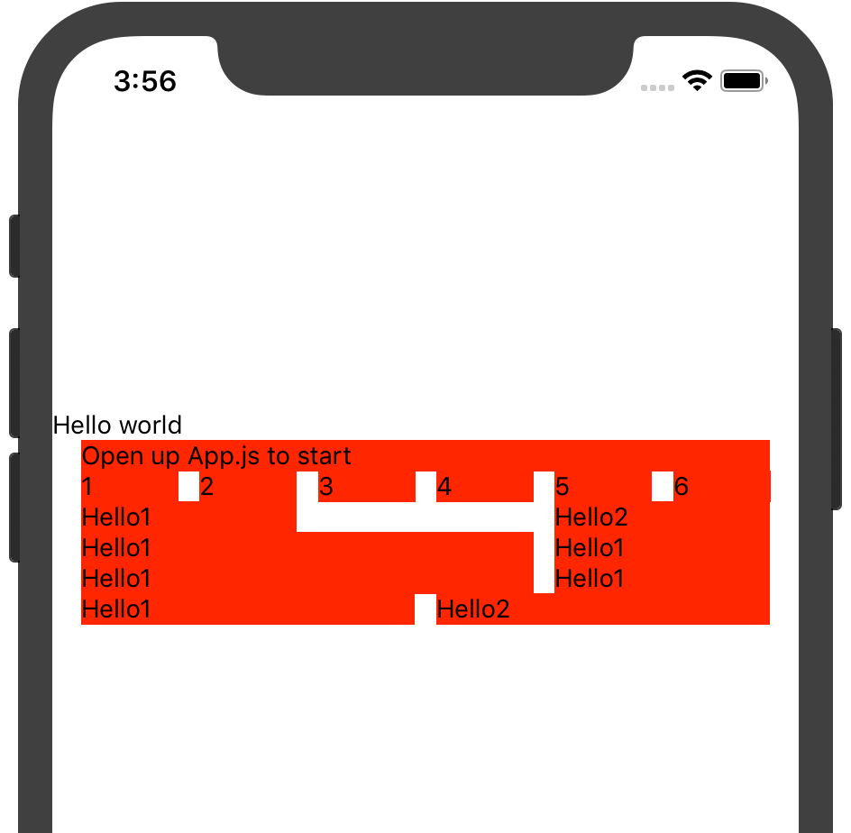

# nu-grid-react-native

[![npm package][npm-badge]][npm]

[npm-badge]: https://img.shields.io/npm/v/npm-package.png?style=flat-square
[npm]: https://www.npmjs.org/package/@y-fe/nu-grid-react-native

这是 NU 「 no-ui 」 组件库系统 nu-system，Grid 组件 React-native 实现。

## 怎么用？

```
npm i @y-fe/nu-grid-react-native
```

```
yarn add @y-fe/nu-grid-react-native
```

### 二次封装

```JSX
import React from 'react';
import Grid from '@y-fe/nu-grid-react-native';

const {Row, Col, Wrap} = new Grid({
    gridNum: 6,            // 列数
    gutterInside: 12,      // 内间距宽
    gutterOutSide: 16      // 外间距宽
});

export default Grid;
export {Row, Col, Wrap};
```

### 使用

```JSX
import React from 'react';
import {StyleSheet, Text, View} from 'react-native';
import {Row, Col, Wrap} from "./components/Grid/index.js";

export default function App() {
    return (
        <View>
            <Text>Hello world</Text>
            <Wrap>
                <Text style={styles.col}>Open up App.js to start</Text>
            </Wrap>
            <Row>
                <Col span={1}><Text style={styles.col}>1</Text></Col>
                <Col span={1}><Text style={styles.col}>2</Text></Col>
                <Col span={1}><Text style={styles.col}>3</Text></Col>
                <Col span={1}><Text style={styles.col}>4</Text></Col>
                <Col span={1}><Text style={styles.col}>5</Text></Col>
                <Col span={1}><Text style={styles.col}>6</Text></Col>
            </Row>
            <Row>
                <Col span={2}><Text style={styles.col}>Hello1</Text></Col>
                <Col span={2} offset={2}><Text style={styles.col}>Hello2</Text></Col>
                <Col span={4} widthToInt><Text style={styles.col}>Hello1</Text></Col>
                <Col span={2}><Text style={styles.col}>Hello1</Text></Col>
                <Col span={4}><Text style={styles.col}>Hello1</Text></Col>
                <Col span={2}><Text style={styles.col}>Hello1</Text></Col>
            </Row>
            <Row>
                <Col span={3}><Text style={styles.col}>Hello1</Text></Col>
                <Col span={3}><Text style={styles.col}>Hello2</Text></Col>
            </Row>
        </View>
    );
}
```




### Api `Grid`

| props   |      类型      |       默认值      |  功能 |
|:----------|:-------------:|:-------------:|------:|
| gridNum |  number | `6` | 列数 |
| gutterInside |  number | `12` |  列之间的间距 |
| gutterOutSide | number  |  `16` | 列距离屏幕边缘的间距 |


### Api `Col`

| props   |      类型      |       默认值      |  功能 |
|:----------|:-------------:|:-------------:|------:|
| span |  number | `1` | 所占的列数 |
| offset |  number | `0` |  偏移的列数 |
| widthToInt | bool  |  `false` | 是否单位采用整数，默认是采用百分比 |
